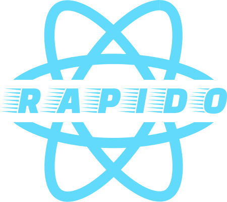

<p align="center">
  
</p>

<h2 align="center">
  <big>
    <b>Rapido</b>
  </big>
</h2>

<div align="center">
  <strong>
    Build universal native apps incredibly fast.
  </strong>
  <br />
  <br />
  <a href="https://github.com/rapidojs/rapido/actions?workflow=build">
    
  </a>
  <a href="https://spectrum.chat/rapido">
    
  </a>
  <a href="https://twitter.com/intent/follow?screen_name=rapidojs">
    
  </a>
</div>

**🚀 Fast**: A powerful toolset that runs on top of [Expo](https://expo.io) making it fast and easy to launch and build Expo apps.

**👌 Convenient**: Stay up to date with the latest tools and libraries (Expo, React, ESLint, etc) with minimal effort.

**🔓 Flexible**: No lock in. Use as much or as little of the Rapido toolset to serve your needs and eject at any time.

<p align="right"><em>See more on <a href="https://rapidojs.dev">rapidojs.dev</a></em></p>

## Quick Overview

```sh
npx @rapido/init my-app
cd my-app
yarn start
```

- [Creating an App](#creating-an-app) – How to create a new app.
- [User Guide](https://rapidojs.dev/) – How to develop apps bootstrapped with Rapido.

Rapido works on macOS, Windows, and Linux.<br>
If something doesn’t work, please [file an issue](https://github.com/rapidojs/rapido/issues/new).<br>
If you have questions or need help, please ask in our [Spectrum](https://spectrum.chat/rapido) community.

## Creating an App

To create a new app, run the following command:

```sh
npx @rapido/init my-app
```

It will create a directory called `my-app` inside the current folder.<br>
Inside that directory, it will generate the initial project structure and install the transitive dependencies:

```
my-app
├── .gitignore
├── README.md
├── package.json
├── app.json
├── App.js
├── App.test.js
├── babel.config.js
├── node_modules
├── assets
│   ├── icon.png
│   └── splash.png
└── web
    ├── favicon.ico
    ├── index.html
    └── manifest.json
```

No configuration or complicated folder structures, just the files you need to build your app.<br>
Once the installation is done, you can open your project folder:

```sh
cd my-app
```

Inside the newly created project, you can run some built-in commands such as:

### `npm start` or `yarn start`

Runs the app in development mode.

### `npm test` or `yarn test`

Runs the test watcher in an interactive mode.<br>

### `npm run build` or `yarn build`

Builds the app for production.<br>

## User Guide

You can find detailed instructions on using Rapido and many tips in [its documentation](https://rapidojs.dev/).

## How to Update to New Versions?

Please refer to the [User Guide](https://rapidojs.dev/docs/updating-to-new-releases) for this and other information.

## Contributing

We'd love to have your helping hand on `rapido`! See [CONTRIBUTING.md](CONTRIBUTING.md) for more information on what we're looking for and how to get started.

## License

Rapido is open source software [licensed as MIT](https://github.com/rapidojs/rapido/blob/master/LICENSE).
